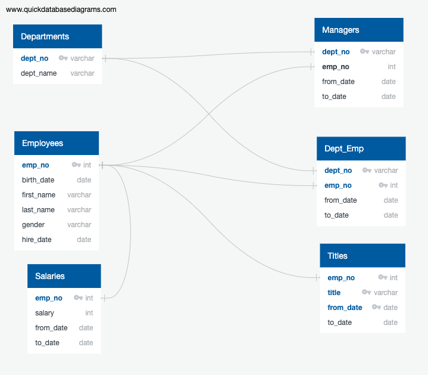
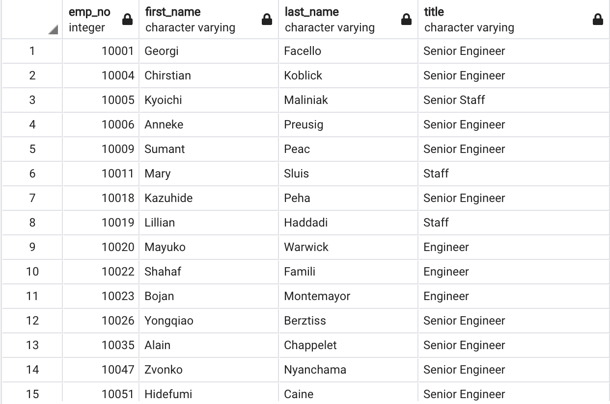
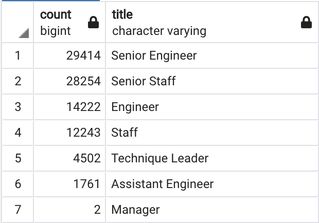
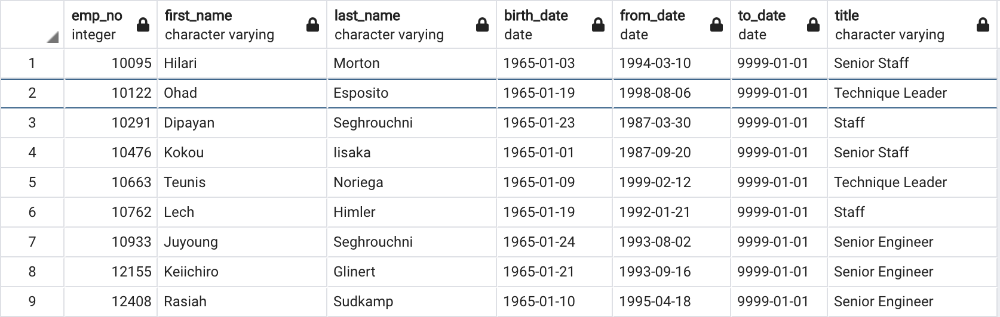

# Pewlett-Hackard-Analysis

### Resources
* PgAdmin4 5.1, 
* PostgreSql,
* SQL, Entity-relationship-diagrams

## Project Overview
Creating an ERD, performing data modeling, creating the database and populating it using data from CSV files, and then completing the analysis on the employee database using SQL and exporting the results in CSV files.

### Creating the ERD.
the first step would be to creat an ERD that shows the logical relationships within the database, the ERD will look like:

## Project Summary

The HR departement at Pewlette Hackard is preparing for several employee retirements, we were tasked with fiding more information about that -like how many, what departments are impacted and to what extent and the titles of these employees - In order to help decide about hiring for the soon available roles.

 * A good number of employees have been with Pewlett Hackard for a very long time because they worked their way up and received promotions. It's important to keep that in mind while conducting our analysis, so here we account for the titles that they currently hold.
 
the following table shows the soon to retire employees and their titles
 
 
 * there's over 90K employee, who are ready for retirement.
 
 it would be insightful to group them using the title:
  
  
  * We can see that Senior employees in general are the ones with highest number (which makes sense since we assumed that most the employees have been with the company for a long time and climbed the ladder) 
  * Most the positions impacted are technical positions (engineers,technique Leaders).
  * there's only a couple manager positions maybe that's worth exploring further.
   
  In the final part of our project we are asked to show mentorship eligibility based on the birth date, we also nmade sure that the employees included in the list are all current, to do so we create the following table:
   
   
  * We can see that most of these employees have senior titles.
  
